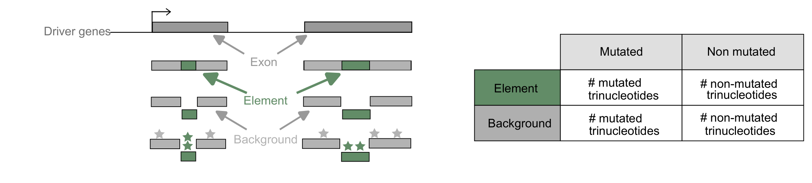

# ExInAtorEL

**ExInAtorEL is an element-level driver-discovery method that assesses mutational burden in annotated lncRNA elements relative to trinucleotide-matched background exon sequences.**

For one element annotation at a time, ExInAtorEL tests whether somatic mutations are enriched inside a class of RNA functional elements (e.g. RNA-binding-protein sites, conserved structures, miRNA response elements, conservation tracks) relative to a **trinucleotide-matched background** drawn from the surrounding lncRNA exonic sequence. Enrichment is scored per element with Fisher's exact test, corrected for multiple testing across element types within a cohort, and can be summarised as a cross-cancer heatmap.



*The ExInAtorEL model. Within driver-gene exons, each annotated element is compared against the surrounding exonic background; mutated and non-mutated trinucleotides in each are tallied into a 2×2 table and tested for enrichment.*

---

## Table of contents

- [Method in brief](#method-in-brief)
- [Repository layout](#repository-layout)
- [System requirements](#system-requirements)
- [Installation guide](#installation-guide)
- [Input files](#input-files)
- [Demo](#demo)
- [Instructions for use](#instructions-for-use)
- [Pipeline stages](#pipeline-stages)
- [Output schema](#output-schema)
- [Configuration & customization](#configuration--customization)
- [Reproduction](#reproduction)
- [Troubleshooting](#troubleshooting)

---

## Method in brief

Somatic mutation rates are strongly shaped by local **trinucleotide context** (the classic mutational-signature effect). A naïve count of mutations inside an element will therefore look "enriched" simply because the element happens to be rich in mutable contexts. ExInAtorEL controls for this by:

1. **Building sequence models** — for each lncRNA it derives merged exon, intron and background intervals from the whole-genome annotation and a cohort-specific GTF.
2. **Partitioning the signal** — exonic regions are split into *element* and *non-element* (background) portions; mutations are intersected against each.
3. **K-mer matching** — 3-mer (trinucleotide) composition is counted for both portions, and a background expectation is generated by **bootstrap resampling** matched on that composition.
4. **Testing** — the element collapses into a single 2×2 contingency table (`element-mutated`, `element-not-mutated`, `background-mutated`, `background-not-mutated`) scored with **Fisher's exact test** (odds ratio + p-value).
5. **Correcting** — across all element types in a cohort, p-values are pooled and **Benjamini–Hochberg** FDR-corrected (α = 0.1).
6. **Visualising** — significant, *enriched* elements (log2OR > 0, q < 0.1) are tiled into a cross-cohort heatmap.

The analysis can be run **strand-specifically** (recommended for stranded element annotations such as RBP sites) or unstranded.

---

## Repository layout

```
ExInAtorEL/
├── Main.py                  # Stage 1 — the enrichment engine (Python 2.7)
├── process_outputs.py       # Stage 2 — aggregate per-element outputs   (Python 3)
├── bh_correction.py         # Stage 3 — Benjamini–Hochberg FDR          (Python 3)
├── heatmaps.py              # Stage 4 — cross-cohort heatmap            (Python 3)
├── run_exinator_el.sh       # Wrapper: chains stages 1–4 for one element
├── submit_exinator_el.sh    # LSF submitter (job array, one job per element)
├── compare_cohorts.sh       # Helper: multi-cohort comparison heatmap
├── model.png                # Model schematic (used by the README)
├── Inputs/                    # Small demo dataset (element + mutations)
│   ├── snhg14_mutations.bed
│   └── snhg14_crs.bed
│   └── 3mers
│   └── chromosomes_38.bed
├── .gitignore
└── README.md
```

---

## System requirements

### Software dependencies (with versions)

| Component | Version | Used by |
|---|---|---|
| Python (engine) | **2.7** | `Main.py` |
| Python (post-processing) | **3.x** (` e.g. 3.11>`) | `process_outputs.py`, `bh_correction.py`, `heatmaps.py` |
| BEDTools | **2.27.1** | `Main.py` (intersect / merge / subtract / getfasta) |
| R | **4.3.3** | loaded by the wrapper for downstream steps |

Because the engine is Python 2.7 and the post-processing is Python 3, the two run in **separate conda environments** (`py27` and `2022_base` in the reference setup).

### Operating systems

- **Linux** (64-bit). Developed and tested on a high-performance computing cluster running.
- The per-element analysis (`Main.py` + post-processing) is plain Linux and does not itself require LSF; only the array submitter (`submit_exinator_el.sh`) does.

### Hardware

- **Non-standard hardware:** running a full cohort as designed requires access to an **LSF HPC cluster** (for the job array). A single element can be run on a normal Linux workstation with sufficient RAM; no GPU is required.

---

## Installation guide

```bash
git clone https://github.com/Roofiya/ExInAtorEL.git
cd ExInAtorEL

# --- engine environment (Python 2.7) ---
conda create -n py27 python=2.7 -y
conda activate py27
conda install -c bioconda bedtools=2.27.1 -y
pip install numpy scipy regex

# --- post-processing environment (Python 3) ---
conda create -n 2022_base python=3 -y
conda activate 2022_base
pip install pandas numpy scipy statsmodels seaborn matplotlib regex
```

> Replace `py27` / `2022_base` with your own env names, then update the matching `conda activate` lines in `run_exinator_el.sh`.

**Typical install time** (normal desktop): ≈ **5–15 minutes** for both conda environments, dominated by conda's dependency solve and package downloads (network-dependent). R 4.3.3 is assumed to be provided by your system/module environment.

---

## Input files

| Flag (`Main.py`) | File | Description |
|---|---|---|
| `-i` / `--input_file` | `mutations.bed` | Somatic mutations, sorted, one per line (BED) |
| `-f` / `--fasta_file` | `genome.fa` | Reference genome FASTA (must match GTF contig naming, e.g. no-`chr`) |
| `-g` / `--gtf_file` | `cohort.gtf` | **Cohort-specific** lncRNA gene annotation |
| `-e` / `--element_file` | `element.bed` | The RNA element annotation being tested |
| `-r` / `--exc_regions` | `blacklist.bed` | Regions to exclude (low mappability, repeats, etc.) |
| `-s` / `--chr_sizes` | `chromosomes.bed` | Chromosome sizes / intervals |
| `-k` / `--kmers_file` | `3mers.txt` | List of trinucleotides for background matching |
| `-w` / `--whole_genome` | `gencode.*.gtf` | Whole-genome lncRNA annotation (for gene models) |
| `-n` / `--number_of_genomes` | `n` | Number of resampled genomes |
| `-b` / `--background_size` | `10000` | Bootstrap iterations |
| `-c` / `--cores` | `6` | Parallel cores |
| `-ss` / `--strand_specific` | `true` / `false` | Strand-aware analysis |

> Run `python2.7 Main.py -h` to print the argument list.

---

## Demo

A minimal demo dataset is provided in **`Inputs/`**:

- `Inputs/snhg14_crs.bed` — RNA-element intervals (chromosome `15`).
- `Inputs/snhg14_mutations.bed` — 3000 simulated somatic mutations.

These are the two **element and cohort-specific** inputs. The shared reference inputs (genome FASTA, lncRNA GTFs, blacklist, chromosome sizes, 3-mer list) are large and access-controlled, so they are **not** bundled — supply your own, or subset them to chromosome `15` for a fully self-contained demo, e.g.:

**Expected output.** A per-element folder under `Outputs` containing `counts_output.tsv`, `counts.txt`. The key file, `counts_output.tsv`, holds one row with the 2×2 contingency counts and the test statistics (`Element`, `Element Mutations(M)`, `Element Not Mutated(N-M)`, `Non Element Mutations:(m)`, `Non Element not mutated:(n-m)`, `OR-FET`, `p-value FET`, `chisq-stat`, `chi p-value`). Running the full wrapper additionally produces `na_output_<COHORT>.csv` (see [Output schema](#output-schema)), the BH-corrected CSV, and the heatmap PDF.

**Expected run time.** ≈ **5–6 minutes per element** on a normal desktop/compute node (dominated by the 10,000-iteration bootstrap). A full cohort of **252 elements**, submitted as an LSF job array, completes in ≈ **3 hours** wall-clock (depending on cluster parallelism and queue wait).

> Because the bootstrap is seeded (`random.seed(135)`), repeated runs on the same inputs are reproducible.

---

## Instructions for use

### Running on your own data

The pipeline is launched on an LSF cluster through **`submit_exinator_el.sh`**, which submits a **job array** — one job per element BED file. Each job runs `run_exinator_el.sh`, which chains all four stages for that element (engine → aggregate → BH-correct → heatmap) and handles the `py27` → `2022_base` environment switch.

**1. Configure `submit_exinator_el.sh`** (top of the file):
- the element BED directory and the **array size** `#BSUB -J GEL[1-N]` (set `N` to the number of `.bed` files in that directory),
- `MUTATION_FILE`, `GTF`, and the cohort label `GENESET`,
- `STRAND` (`true` / `false`),
- the working directory and log paths.

**2. Set the shared paths** once in `run_exinator_el.sh` (`BASE_DIR`, `PIPELINE_DIR`, the Python-3 interpreter, and the shared input files) — see [Configuration](#configuration--customization).

**3. Submit:**

```bash
bsub < submit_exinator_el.sh
```

Outputs are organised by `strand_specific` (or `unstranded`) → `GENESET` → element, under the directory tree rooted at `PIPELINE_DIR`.

---

## Pipeline stages

### Stage 1 — `Main.py` (engine, Python 2.7)
Builds per-lncRNA exon/intron/background models, partitions exonic sequence into element vs. background, intersects mutations, derives the k-mer-matched background by bootstrap, and runs Fisher's exact + χ² per element.
**Produces:** `counts_output.tsv`, `kmer_counts_output.tsv`, `ExInAtor_Gene_List.txt` (per element folder).

### Stage 2 — `process_outputs.py` (Python 3)
Concatenates the per-element TSVs across the cohort, computes `log2OR = log2(OR-FET)` and `10logp = −log10(p-value FET)`, and writes the cohort tables.
**Produces:** `output_<COHORT>.csv` and `na_output_<COHORT>.csv`, plus combined `counts_data.tsv` / `kmer_counts_data.tsv`.

### Stage 3 — `bh_correction.py` (Python 3)
Pools p-values across all `na_*.csv` element rows in the cohort directory, **filtering to rows where both `Element Mutations(M) ≥ 1` and `Non Element Mutations:(m) ≥ 1`**, applies Benjamini–Hochberg (`statsmodels.multipletests`, α = 0.1, `fdr_bh`), and writes back the corrected q-value.
**Adds columns:** `Corrected P-Value`, `-log10(fdradjp)`.

### Stage 4 — `heatmaps.py` (Python 3)
Reads `na_output_<cohort>.csv` for each cohort, pivots `log2OR` (heatmap color) annotated with `Corrected P-Value`, masks cells that are depleted (`log2OR ≤ 0`) or non-significant (`q ≥ 0.1`), and renders a PDF.
**Produces:** `cohort_elements.pdf`.

---

## Output schema

`na_output_<COHORT>.csv` — one row per element type:

| Column | Meaning |
|---|---|
| `Element` | Element type (`rbp_combined`, `100way`, `crss`, …) |
| `Element Mutations(M)` | Number of mutated trinucleotides in the element |
| `Element Not Mutated(N-M)` | Number of non-mutated trinucleotides  in the element |
| `Non Element Mutations:(m)` | Number of mutated trinucleotides in the background (non-element exonic) |
| `Non Element not mutated:(n-m)` | Number of non-mutated trinucleotides in the background (non-element exonic |
| `OR-FET` | Odds ratio (Fisher's exact test) |
| `p-value FET` | Fisher's exact p-value |
| `chisq-stat` / `chi p-value` | χ² statistic and p-value |
| `log2OR` | `log2(OR-FET)` — the heatmap colour |
| `10logp` | `−log10(p-value FET)` |
| `Corrected P-Value` | BH-FDR q-value (Stage 3) |
| `-log10(fdradjp)` | `−log10` of the q-value |

---

## Configuration & customization

**Cluster paths.** `run_exinator_el.sh` and `submit_exinator_el.sh` use placeholder paths (`/path/to/...`) marked `>>> INSERT YOUR PATH <<<`. Before the first run, set `BASE_DIR`, `PIPELINE_DIR`, the Python-3 interpreter, the shared input files, and the `module load` / `conda activate` lines to match your environment.

### Making heatmaps — three ways

`heatmaps.py` reads the BH-corrected tables and draws the element × cohort enrichment heatmap. There are three ways to produce one, depending on whether you want a single cohort, a chosen comparison, or everything.

**1. Automatically, per cohort (default — no action needed).**
Every pipeline run already makes a heatmap for *its own* cohort: `run_exinator_el.sh` calls heatmaps with `--cohorts "$GENE_SET"`. So a shared `$BH_DIR` holding many cohorts is never swept into one figure by accident.

**2. With the helper script `compare_cohorts.sh` (easiest comparison).**
Set the two paths once at the top of `compare_cohorts.sh` (same `BH_DIR` / `HEATMAP_DIR` as the wrapper), then just list cohort names — it fills in the rest:
```bash
./compare_cohorts.sh AC PCAWG          # -> --cohorts sample,AC,PCAWG
```

**3. By calling `heatmaps.py` directly (full control).**
Run it with explicit paths, cohorts, and optional display labels:
```bash
python3 heatmaps.py \
    -i <bh_dir> -o <heatmap_dir> \
    --cohorts AC,PCAWG \
    --labels  "All cancer drivers,PCAWG drivers"
```

Notes for ways 2 and 3:
- **Omit `--cohorts`** → auto-detects and plots **every** cohort under `<bh_dir>` (any sub-folder with an `na_output_<cohort>.csv`).
- **Omit `--labels`** → the cohort folder names are used as labels.
- `--cohorts` must be **comma-separated with no spaces** (`AC,PCAWG` not `AC, PCAWG`); the helper handles this.
- Missing cohorts are skipped with a warning. Each cohort must have finished (its `na_output_<cohort>.csv` must exist).
- Run from where `heatmaps.py` lives, with the Python-3 environment active (`Eg: conda activate 2022_base`).
- Element identifiers are renamed for display via the `rename_dict` near the top of the script (e.g. `crss → "Conserved RNA secondary structures"`).

**Pooled-gene label (engine).** `Main.py` collapses all element exons under a single gene label so each element yields one contingency table. This label is **derived from the first record of `merged_exons.bed`**, so it is guaranteed to exist in `genes.bed` for any GTF:

**Significance threshold.** BH α and the heatmap mask both use **0.1**; change in `bh_correction.py` (`alpha=`) and `heatmaps.py` (mask condition) together.

---

## Reproduction

To reproduce the quantitative results in the manuscript:

1. Obtain the cohort mutation files and element annotations.
2. Set the references and paths as in [Configuration](#configuration--customization); use the default parameters (`α = 0.1, seed = 135).
3. Run each cohort via `submit_exinator_el.sh`, then collect the cohorts in `heatmaps.py`'s `cancer_types` to regenerate the cross-cohort enrichment figure.

---

## Troubleshooting

| Symptom | Likely cause |
|---|---|
| All-zero counts / empty `na_output` | Contig naming mismatch (`chr1` vs `1`) between FASTA/GTF/BED, or pooled-gene label absent from `genes.bed` |
| `heatmaps.py` `KeyError` on a cohort | A `na_output_<cohort>.csv` is missing, or `cancer_types` lists a folder that wasn't produced |
| Wrapper "works" but a step produced nothing | `subprocess.call(..., shell=True)` does **not** raise on error — check stderr of each BEDTools/awk call |
| `multipletests` empty-input error | No element rows passed the `M ≥ 1` & `m ≥ 1` filter |
| Engine import errors | `Main.py` must run under the **Python 2.7** env, not Python 3 |
